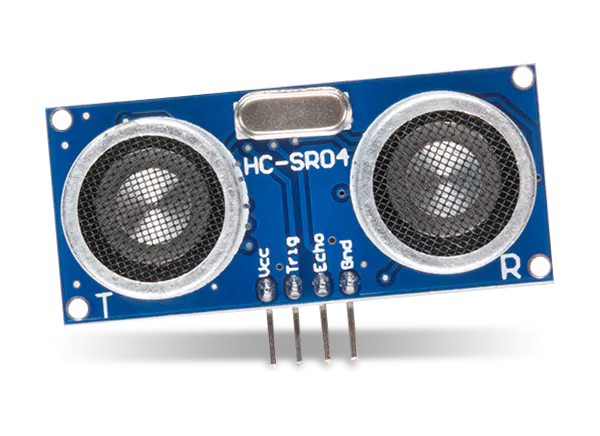

# WATER TANK CONTROLLER

### Team members

* Filip Kocum, 22xxxx (responsible for xxx)
* Martin Knob, 22xxxx (responsible for xxx)
* Gregor Karetka, 22xxxx (responsible for xxx)
* Samuel Košík, 221056, (crying, not helping)

Link to this file in your GitHub repository:

[https://github.com/amwellius/DE2_Project_2021-22](https://github.com/amwellius/DE2_Project_2021-22)

### Table of contents

* [Project objectives](#objectives)
* [Hardware description](#hardware)
* [Libraries description](#libs)
* [Main application](#main)
* [Video](#video)
* [References](#references)

## Project objectives

Write your text here.

## Hardware description

### Arduino Uno + breadboard 
[Datasheet](https://github.com/amwellius/DE2_Project_2021-22/blob/main/Datasheets%20%2B%20DOCs/ATMega_328P_datasheet.pdf)

&nbsp;

&nbsp;

### Nokia 5110 LCD display 
[Datasheet](https://github.com/amwellius/DE2_Project_2021-22/blob/main/Datasheets%20%2B%20DOCs/Nokia5110_datasheet.pdf)

&nbsp;

&nbsp;

### RGB LED, Relay Modules (1, 2, or 4 relays) ...........PARTICULAR..........
[Datasheet](link)

&nbsp;

&nbsp;

### UltraSonic sensor HC-SR04
[Datasheet](https://github.com/amwellius/DE2_Project_2021-22/blob/main/Datasheets%20%2B%20DOCs/HCSR04.pdf)

&nbsp;

&nbsp;

**TIEZ ASI RADSEJ VLASTNY OBRAZOK**
Main sensor (one of **two???**) for measuring the water level of the tank. After entering its dimensions (or volume), the sensor is calibrated. Providing it with short 10us pulse will result in receiving 8 cycles of 40MHz signal. This will be given by *ECHO pin*, so received value will the time the wave travelled to the watel level and back to the sensor. Final distance can be obtained by this equation: 

&nbsp;

&nbsp;

Where **t** is the received value on **ECHO pin** and *0.034* cames from ste speed of soun *(340 m/s = 0.034 m/us)*. Sound wave travels from sensor to water, but from water to the sensor as well. That is why the result has to be devidec by two. 

## Libraries description

Write your text here.

## Main application

Write your text here.

## Video

Write your text here

## References

1. Write your text here.
