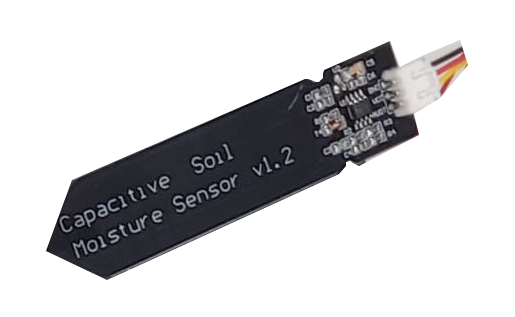

**2021**, Faculty of Electrical Engineering and Communication [FEKT](https://www.fekt.vut.cz/) <br/> 
 <br/>
# WATER TANK CONTROLLER

### Team members

- **Gregor Karetka**   &nbsp;                             *id=221053*   &nbsp;&nbsp;    <br/> 
- **Martin Knob**   &nbsp;&nbsp;&nbsp;&nbsp;&nbsp;               *id=221054*   &nbsp;&nbsp;     <br/>
- **Filip Kocum**   &nbsp;&nbsp;&nbsp;&nbsp;&nbsp;&nbsp;   *id=221055*   &nbsp;&nbsp;     <br/> 
- **Samuel Košík**   &nbsp;&nbsp;&nbsp;&nbsp;              *id=221056*   &nbsp;&nbsp;    <br/> 


Link to this file in GitHub repository:

[https://github.com/amwellius/DE2_Project_2021-22](https://github.com/amwellius/DE2_Project_2021-22)

### Table of contents

* [Project objectives](#objectives)
* [Hardware description](#hardware)
* [Libraries description](#libs)
* [Main application](#main)
* [Video and Documentation](#video)
* [References](#references)

<a name="objectives"></a>

## Project objectives

This simple but useful application will help you to fully control your **water tank** (not only!) in the garden. Do you want to know how much water left? Do you want to replenish the tank? Or are you interested in controlling your own, independent application based on the volume left in the tank? <br/>
No problem! <br/>
With our **Water Tank Controller** you will be able to:
- know **current water level** in centimeters, percentage and liters,
- see **maximum** volume of the tank,
- use relays to control pump,
- prevent **owerflowing** the tank with extra sensor,
- see **graphic representation** of the water level.


<a name="hardware"></a>

## Hardware description

As main programming board is used **Arduino UNO**. For representing results was chosen **Nokia 5110 LCD display**, **Relay module** and **button** (optional). Main water level sensor is ultraonic **HC-SR04**. There is one extra sensor used as backup to prevent overflowing the tank or detecting filth (leaves, flowers, pollen, ...) in the tank. We have used **Capacitive Soil Moisture Sensor v1.2**. 

### Arduino UNO + breadboard 
[Datasheet](https://github.com/amwellius/DE2_Project_2021-22/blob/main/Datasheets%20%2B%20DOCs/ATMega_328P_datasheet.pdf)

&nbsp;

&nbsp;

Application uses a number of pins and 3.3 V and 5 V power supply. Schematic can be seen here [SCHEMATIC](https://github.com/amwellius/DE2_Project_2021-22/blob/main/schematic.pdf). 

### Nokia 5110 LCD display 
[Datasheet](https://github.com/amwellius/DE2_Project_2021-22/blob/main/Datasheets%20%2B%20DOCs/Nokia5110_datasheet.pdf)

&nbsp;

&nbsp;

All output data is shown on Nokia LCD display. Library from internet has been edited in order to use with *Arduino UNO*. Display's resolution **84x48**  allows to display many useful data or **graphic representation** of water level as well. Drawn images were converted to **byte arrays** to simplify the usege in *Microchip Studio*. <br/>
Picture below shows possible states. <br/>

<br/>
Also some resistors had to be used to properly connect LCD to Arduino board.

### Relay Module 
[Datasheet](https://components101.com/switches/5v-single-channel-relay-module-pinout-features-applications-working-datasheet)

&nbsp;

&nbsp;

Usage of relay(s) is optional. **C code** has implemented section which triggers the relay module by pressing **button** connected to Arduio UNO. **A capacitor** inserted in cicruit helps to stabilize *overoscillations* generated by the button.

### UltraSonic sensor HC-SR04
[Datasheet](https://github.com/amwellius/DE2_Project_2021-22/blob/main/Datasheets%20%2B%20DOCs/HCSR04.pdf)

&nbsp;

&nbsp;

Main sensor for measuring the water level of the tank. After entering its **dimensions** the sensor is calibrated. Providing it with short 10us pulse will result in receiving 8 cycles of 40KHz signal. This will be given by *ECHO pin*, so received value will be the time the wave travelled to the water and back to the sensor. Final distance can be obtained by this equation: 

&nbsp;

&nbsp;

Where **t** is the received value on *ECHO pin* and **0.034** cames from the speed of sound *(340 m/s = 0.034 m/us)*. Sound wave travels from sensor to water, but from water to the sensor as well. That is why the result has to be devided by two. *Arduino UNO's* **timers** are used to measure width of received square signal. After calculation, distance in milimeters is returned. Its value is sent to other functions, so supplementary data can be sent to display on *Nokia LCD*.

### Capacitive Water Lever Sensor

[Datasheet](https://github.com/amwellius/DE2_Project_2021-22/blob/main/Datasheets%20%2B%20DOCs/water_level_sensor.pdf)

It is situated **a few centimeters** above main ultrasonic sensor. If ultrasonic **fails**, this option will prevent **overflowing** the water tank. Display will print **System overflow** message. Relay module can the programmed for specific behavior after getting to *overflow* stage, too (optional). <br/>
Sensor is connected to *analog input* pin, *GND* and *Vcc=5 V*. Its usage describes table below. <br/>
   
   | **Value** | **Results in** |
   | :-: | :-: |
   | <=850 | System working properly. |
   | >850 | System malfunction! |


&nbsp;



<a name="libs"></a>

## Libraries description

Code for this application was written in **C**, compilated using **AVR/GNU C compiler** and **MicroChip Studio**. Project consists of several libraries, list of all files can be found below:
   - `main.h`- main function header,
   - `main.c` - includes main procedures and functions,
   - `english_font.h` - characters for LCD display,
   - `nokia_5110_lcd.h` - header for LCD display,
   - `nokia_5110_lcd.c` - functions for LCD controlling,
   - `water_symbols.h` - header for c file,
   - `water_symbols.c` - byte maps (figures on LCD), 
   - `gpio.h` - input/output header,
   - `gpio.c` - input/output functions,
   - `timer.h` - header for timers in *Arduino UNO*,
   - `HC-SR04.h` - header for *ultrasonic sensor*,
   - `HC-SR04.c` - definitions for *ultrasonic sensor*.

All files are available here:
   [`main.h`](https://github.com/amwellius/DE2_Project_2021-22/blob/main/code/water_height_meter/main.h), [`main.c`](https://github.com/amwellius/DE2_Project_2021-22/blob/main/code/water_height_meter/main.c), [`english_font.h`](https://github.com/amwellius/DE2_Project_2021-22/blob/main/code/water_height_meter/english_font.h), [`nokia_5110_lcd.h`](https://github.com/amwellius/DE2_Project_2021-22/blob/main/code/water_height_meter/nokia_5110_lcd.h), [`nokia_5110_lcd.c`](https://github.com/amwellius/DE2_Project_2021-22/blob/main/code/water_height_meter/nokia_5110_lcd.c), [`water_symbols.h`](https://github.com/amwellius/DE2_Project_2021-22/blob/main/code/water_height_meter/water_symbols.h), [`water_symbols.c`](https://github.com/amwellius/DE2_Project_2021-22/blob/main/code/water_height_meter/water_symbols.c), [`gpio.h`](https://github.com/amwellius/DE2_Project_2021-22/blob/main/code/water_height_meter/gpio.h), [`gpio.c`](https://github.com/amwellius/DE2_Project_2021-22/blob/main/code/water_height_meter/gpio.c), [`timer.h`](https://github.com/amwellius/DE2_Project_2021-22/blob/main/code/water_height_meter/timer.h), [`HC-SR04.h`](https://github.com/amwellius/DE2_Project_2021-22/blob/main/code/water_height_meter/HC-SR04.h), [`HC-SR04.c`](https://github.com/amwellius/DE2_Project_2021-22/blob/main/code/water_height_meter/HC-SR04.c).

Some important parts of codes will be discuss. 

#### `main.c`
Example of controlling graphic representation of water level.
```c          
if (percentage == 100) selector = 10;
if (selector == 0) {            
    LCD_write_bytes_xy_defined_width((unsigned char*)water_level_default, 14, 70, bucket_x, bucket_y);
} else {
    LCD_write_bytes_xy_defined_width((unsigned char*)all_water_states[selector], 14, 70, bucket_x, bucket_y);
}            

// display maximum
itoa(tank_volume, distance_str, 10);
LCD_write_english_string(0, 0, "Vmax:");
LCD_write_english_string_continue(distance_str);
LCD_write_english_string_continue(" L");
```

#### `nokia_5110_lcd.h`
Functions used to control LCD Nokia Display.
```c
void LCD_clear();
void LCD_init();
void LCD_write_byte(unsigned char dat, unsigned char command);
void LCD_write_english_string(unsigned char X,unsigned char Y,char *s);
void LCD_write_english_string_continue(char *s);
void LCD_write_english_string_continue_precise(char *s, uint16_t data_len);
void LCD_write_char(unsigned char c);
void LCD_set_XY(unsigned char X, unsigned char Y);
void LCD_write_init();
void LCD_write_whole_screen(unsigned char *cells, uint16_t cells_n, uint16_t start_x, uint16_t start_y);
void LCD_write_bytes_xy_defined_width(unsigned char *cells, uint16_t width, uint16_t size, uint16_t x, uint16_t y);
```

#### `water_symbols.c`
Example of byte map (icon of 70% left).
```c
const unsigned char water_level_70[] = {
    // 'water level 70%', 14x35px
    0xfe, 0x01, 0x01, 0x01, 0x01, 0x01, 0x01, 0x01, 0x01, 0x01, 0x01, 0x01, 0x01, 0xfe, 0xff, 0x00,
    0xf8, 0xf8, 0xf8, 0xf8, 0xf8, 0xf8, 0xf8, 0xf8, 0xf8, 0xf8, 0x00, 0xff, 0xff, 0x00, 0xff, 0xff,
    0xff, 0xff, 0xff, 0xff, 0xff, 0xff, 0xff, 0xff, 0x00, 0xff, 0xff, 0x00, 0xff, 0xff, 0xff, 0xff,
    0xff, 0xff, 0xff, 0xff, 0xff, 0xff, 0x00, 0xff, 0x07, 0x04, 0x05, 0x05, 0x05, 0x05, 0x05, 0x05,
    0x05, 0x05, 0x05, 0x05, 0x04, 0x07
};
```

#### `HC-SR04.c`
Calculation of water level distance.
```c
TCCR1B |= (1 << ICES1);                                             // Reset to rising edge
        falling = ICR1;                                             // Read value ticks
        counts = falling - rising;                                  // Calc. difference between start and stop of the pulse
        dist = ((US_PER_COUNT * (uint32_t)counts) * 340) / 2000;    // Distance in mm
        
        for (int8_t i = 9; i >= 1; i--) {
            dist_vals[i] = dist_vals[i-1];
        }
        dist_vals[0] = dist;
```


<a name="main"></a>

## Main application


The main purpose of this application is to automatize operation of regulating water level in specified tank. After knowing **volume of owned tank**, ultrasonic sensor connected to *Arduino UNO* board will measure the water level. *LCD Nokia 5110* display shows water level in *centimeters*, *percentage* and *maximum usable volume of the water-tank*. Application uses **one extra sensor** to control the maximum volume. In normal conditions, sensor gives negative data of water level all time. It is situated few centimeters **above** the max bound of water (we do not want to fill the tank completely to prevent owerflow). If the water reaches this sensor, ultrasonic has occurred hassle and LCD shows problem **(`Owerflow`, `Error`)**.

Our product has the ability to interact with relay modules for external usage. These can be used to replenish the tank, irrigation pump control, DC fans, windows opening, and others. 

### How to use
1. Mount *ultrasonic sensor* on the top of water tank. Sensor's reference **zero (100%)** is set to be 4 centimeters from the ultrasonic transceiver.
2. Mount *Capacitive sensor* about **1 centimeter** above max water height. (If ultrasonic fails, capacitive sensor will save it from drowning).
3. Insert dimensions of your water tank into *C code*. If maximum height of your tank is e.g. 100 cm, than insert only 96 cm, to prevent owerflow.
   ```c
   // Tank Volume
   //**Enter values in cm !
   #define TANK_X  ((uint32_t)80)
   #define TANK_Y  ((uint32_t)80)
   #define TANK_Z  ((uint32_t)96)
   ```
4. Application is now set up. The *Nokia LCD screen* provides needed information according figure below. User can see data as
   - MAX volume of the tank in liters: `Vmax:800 L`,
   - Actual volume of water in the tank in liters: `Vact:441 L`,
   - Actual volume of water in the tank in percentage: `Vact:55 %`,
   - Actual volume of water represented by a up-time graphic icon,
   - System status message: `OK`, `ERROR`, `OVERFLOW`.
   <br/>
   
   
6. Relay module is set to interact with pressing installed button. **Do not** hesitate to use your creativity and relay module (modules) on your own by simply editing the code. 


### Possible Stages
After powering on, test screen procedure runs (represented by `DE2 Water System` screen and `graphic tank icon` filling up). System is ready to operate! 

#### System OK
Level of water in tank is between **0** and **100%**, *capacitive sensor* is not activated by water reaching its level; system working correctly.

#### System ERROR
Rises when unexpected data is measured. 
   - Bad *ultrasonic calibration*, too close *(<4 cm)* or too far *(>400 cm)*,
   - Bad tank dimensions,
   - Capacitor used with relay module and button not connected properly,
   - Apocalypse.  

#### System OVERFLOW
*Ultrasonic sensor* occurred **problem**. Water reaches *capacitive sensor*. Different data received from two sensors leads to system `Overflow` stage message.


<a name="video"></a>

## Video and Documentation

Video available here: <br/>
   [Link to YouTube](https://www.youtube.com/watch?v=HSv_cm3vf8U) 
   
Documentation available here: <br/>

<a name="references"></a>

### Schematic


## References

### Used materials:
   - Theoretical knowledge from Digital-Electronics-2, 2021 > [Link](https://moodle.vut.cz/course/view.php?id=242365)
   - Lab classes **DE2** > [Link](https://github.com/tomas-fryza/Digital-electronics-2)
   - Byte Arrays Generator > [Link](https://javl.github.io/image2cpp/)
   - LaTeX equation editor > [Link](https://www.codecogs.com/latex/eqneditor.php)
   
 
   ### Used programs and its links:
   - [MicroChip Studio](https://www.microchip.com/en-us/development-tools-tools-and-software/microchip-studio-for-avr-and-sam-devices)
   - [SimulIDE](https://www.simulide.com/p/home.html)
   - [GitHub](https://github.com/)
   - [GitHub Desktop](https://desktop.github.com/)
   - [Git Bash](https://git-scm.com/download/win)
   - [KiCAD](https://componentsearchengine.com/library/kicad?gclid=CjwKCAiAksyNBhAPEiwAlDBeLB2QSESyWl1669aV7oK23ZJxxCjH-YFDBnxbHhdrZ5DbmMH_Wg5LuBoCEQUQAvD_BwE)

All pictures have been taken in DE2 Laboratories!
   
________________________________________________________________________________
©2021, VUT FEKT, Brno, Czech Republic <br/>
Košík, Karetka, Kocum, Knob <br/>
**For Educational Purposes Only!**


